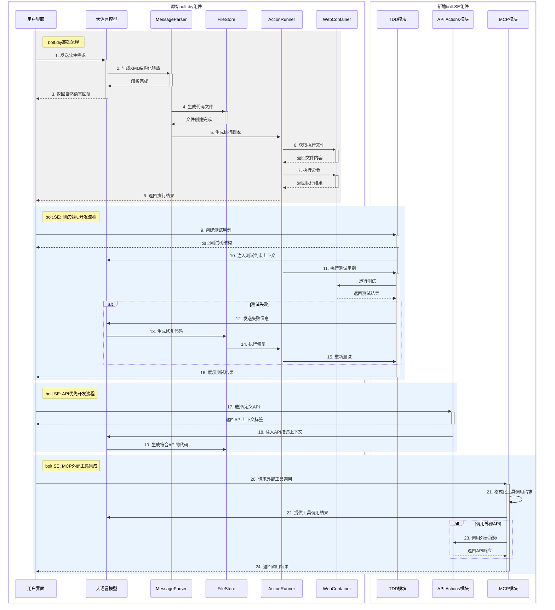

# bolt.SE

bolt.SE，旨在将大语言模型（LLM）的代码生成能力与现代软件工程最佳实践深度融合。该系统基于开源项目bolt.diy 构建，通过四个核心模块增强了LLM辅助开发的工程化程度：首先，API 优先开发模块基于OpenAPI规范实现API定义与管理，使LLM能够理解并生成符合接口规范的代码；其次，测试驱动开发（TDD）模块将“测试先行”理念与代码生成相结合，通过结构化测试约束引导LLM生成高质量代码；再次，模型上下文协议（MCP）模块提供标准化接口使LLM能够安全调用外部工具和数据源，突破知识局限；最后，持续集成与部署模块则结合了TDD模块与MCP模块，实现了从测试定义到自动部署的全链路自动化。



## 运行项目

1. **安装包管理器（pnpm）**：

   ```bash
   npm install -g pnpm
   ```

2. **安装项目依赖**：

   ```bash
   pnpm install
   ```

3. **启动开发服务器**：

   ```bash
   pnpm run dev
   ```


## 配置 API 密钥与模型服务商

### 添加你的 LLM API 密钥

1. 打开首页（主界面）
2. 在下拉菜单中选择你想使用的服务商
3. 点击铅笔图标（编辑）
4. 在安全输入框中输入你的 API 密钥


## 可用脚本命令

* **`pnpm run dev`**：启动开发服务器
* **`pnpm run build`**：构建项目
* **`pnpm run start`**：使用 Wrangler Pages 本地运行构建后的项目
* **`pnpm run preview`**：构建并在本地运行生产版本
* **`pnpm test`**：使用 Vitest 运行测试套件
* **`pnpm run typecheck`**：运行 TypeScript 类型检查
* **`pnpm run typegen`**：使用 Wrangler 生成 TypeScript 类型
* **`pnpm run deploy`**：将项目部署到 Cloudflare Pages
* **`pnpm run lint:fix`**：自动修复代码格式问题

## TODO


- [ ] 接入3L Teacher,包括
  - 将3Lteacher生成的软件需求文档传入 bolt.SE 
  - 接入数据库（当前使用用户的浏览器indexDB本地数据库）
  - 部署（当前pnpm deploy部署到Cloudflare服务）
- [ ] **高优先级！** 加入 Api Actions会曝露API key到聊天记录中（见`interface ApiKeyAuth`）
- [ ] merge origin/import-sample-chat 分支，实现导入范例
- [ ] REAME.md 文档添加界面操作说明（如何添加MCP、如何天界API schemma等）
- [ ] 改善中文翻译
 

## 许可证

本项目基于 [bolt.diy](https://github.com/stackblitz/bolt.diy) 开源项目进行开发，原始项目由 StackBlitz 团队及社区贡献者维护。

本项目遵循 [MIT 许可证](./LICENSE)，您可以自由使用、修改和分发本软件，但需保留原始版权声明。
